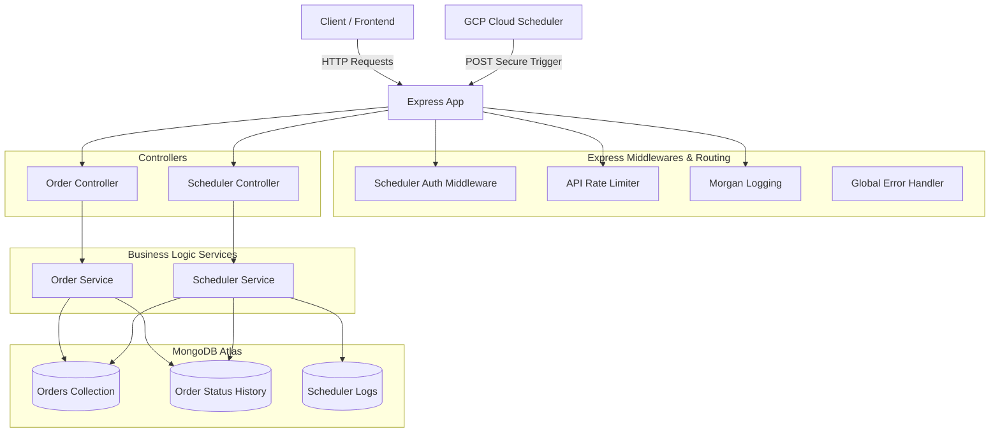

# Dacby OrderFlow Backend API

A highly resilient, production-ready Express.js and Mongoose/MongoDB backend for full-stack order management, state tracking, and automated transitions.
---

## Architectural Overview & Design Patterns

The backend is structured around a clean operational architecture, separating routing, request handling (controllers), business orchestration (services), and schemas (models).




#### 1. API Idempotency (Duplicate Order Prevention)

To prevent double-creation of orders due to rapid clicks or network retries:

- The client generates a unique `idempotencyKey` (UUIDv4) upon displaying the creation modal.
- The `Order` model enforces a Mongoose **unique index** on the `idempotencyKey` field.
- **Double Protection Logic:** The service performs an initial atomic lookup first. If parallel requests bypass this check, the database throws index validation error code `11000`. The service catches this gracefully, fetches the existing winner record, and responds with a status `200 OK` (with message: `"Order already existed for this idempotency key"`) instead of failing or throwing a breaking server exception (`500`).

#### 2. Concurrency Control & Race Condition Safeguard

In high-throughput environments, multiple clients or parallel scheduler runs might attempt to transition the status of an order at the same microsecond.
To resolve this:

- Transitions are executed using Mongoose's atomic helper **`findOneAndUpdate`**.
- The query filter includes both the target document's `_id` and its **expected current status** (e.g. `{ _id: candidate._id, orderStatus: 'PLACED' }`).
- If another concurrent process has already transitioned the status of the order, the query filter will fail to match any document. The update fails gracefully and returns `null`, preventing duplicate status history entry creations and duplicate version increments.
- Mongoose versioning (`__v`) is incremented atomically (`$inc: { __v: 1 }`).

#### 3. Automatic State Machine Scheduler

The database maintains orders in various phases. A scheduled process updates order states based on duration policies configured in environment variables:

- `PLACED` ➔ `PROCESSING` (Default threshold: 10 minutes)
- `PROCESSING` ➔ `READY_TO_SHIP` (Default threshold: 20 minutes)
- Every state transition creates a corresponding history record (`OrderStatusHistory`) logging the state mutation, timestamp, and actor (`SYSTEM_SCHEDULER`).
- A complete diagnostic receipt (`SchedulerLog`) is cataloged per execution, capturing scanned/updated counts, success/failure statuses, durations, and detailed error messages.

#### 4. Scheduler Automation & Security

- To optimize operational costs, the scheduler cron handles execution statelessly. The cron triggers a secure REST API route: `/api/v1/scheduler/run-status-update`.
- Polled securely by **Google Cloud Scheduler** (configured to hit the endpoint at 5-minute intervals), replacing the legacy client/local crons.
- **Security Validation:** Authorization is enforced via the `schedulerAuth` middleware, verifying the custom header key `x-scheduler-secret` against the environment's `SCHEDULER_SECRET_KEY`.

---

## Database Schemas

### 1. `Order`

Stores the current state and metadata of requests.

- `orderId`: String, Unique (Format: `ORD-UUID-SUFFIX`).
- `idempotencyKey`: String, Unique (For duplicate prevention).
- `customerName` & `phoneNumber`: String.
- `productName`: String.
- `amount`: Number, Min: 0.
- `paymentStatus`: String (Enum: `PENDING`, `PAID`, `FAILED`, `REFUNDED`).
- `orderStatus`: String (Enum: `PLACED`, `PROCESSING`, `READY_TO_SHIP`, `SHIPPED`, `DELIVERED`, `CANCELLED`).
- `statusUpdatedAt`: Date (Indicates when the order last transitioned).

> [!TIP]
> **Performance Optimization**: Contains query-optimized compound index on `{ orderStatus: 1, createdAt: -1 }` to guarantee fast paginated searches and status filtering.

### 2. `OrderStatusHistory`

Audit logs tracking state transitions.

- `order`: Reference (ObjectId ➔ `Order`).
- `orderId`: String.
- `fromStatus`: String (Enum or `null` for initial creations).
- `toStatus`: String (Enum).
- `changedBy`: String (Enum: `SYSTEM_SCHEDULER`, `USER`, `API`).
- `note`: String (Reason or details of the transition).

### 3. `SchedulerLog`

Performance analytics and logs for the scheduler process.

- `runId`: String (UUIDv4).
- `startedAt` & `finishedAt`: Date.
- `durationMs`: Number.
- `status`: String (Enum: `SUCCESS`, `PARTIAL_FAILURE`, `FAILED`).
- `ordersScanned` & `ordersUpdated`: Number.
- `transitionsSummary`: Mixed JSON map (e.g. `{"PLACED->PROCESSING": 3}`).
- `errorMessage`: String (Captures stack errors if status is `FAILED`).

---

## API Documentation

### System Routes

#### 1. Health Check

- **Endpoint:** `GET /health`
- **Description:** Returns current API status and timestamp.
- **Response `200 OK`:**

```json
{
  "success": true,
  "message": "API is healthy",
  "timestamp": "2026-07-19T12:42:32.000Z"
}
```

---

### Order Routes (`/api/v1/orders`)

#### 1. Create Order

- **Endpoint:** `POST /`
- **Request Body:**

```json
{
  "customerName": "Spencer Hastings",
  "phoneNumber": "+91 9876543210",
  "productName": "Wireless Earbuds Pro",
  "amount": 2999,
  "idempotencyKey": "9b1deb4d-3b7d-4bad-9bdd-2b0d7b3dcb6d",
  "paymentStatus": "PAID"
}
```

- **Response `201 Created` (First Submission):**

```json
{
  "success": true,
  "message": "Order created",
  "data": {
    "orderId": "ORD-ecc31a44-77a8-48b0-a299-6e3e5c9b1d3d",
    "idempotencyKey": "9b1deb4d-3b7d-4bad-9bdd-2b0d7b3dcb6d",
    "customerName": "Spencer Hastings",
    "phoneNumber": "+91 9876543210",
    "productName": "Wireless Earbuds Pro",
    "amount": 2999,
    "paymentStatus": "PAID",
    "orderStatus": "PLACED",
    "statusUpdatedAt": "2026-07-19T12:42:32.000Z",
    "createdAt": "2026-07-19T12:42:32.000Z",
    "updatedAt": "2026-07-19T12:42:32.000Z"
  }
}
```

- **Response `200 OK` (Duplicate Request - matches `idempotencyKey`):**

```json
{
  "success": true,
  "message": "Order already existed for this idempotency key",
  "data": { ... }
}
```

#### 2. Get Orders (With Search & Pagination)

- **Endpoint:** `GET /`
- **Query Parameters:**
  - `status`: Filters by order status (e.g. `PLACED`, `PROCESSING`, etc.).
  - `search`: Matches query string inside `orderId` or `customerName` (Case-Insensitive Regex).
  - `page`: Page number (Default: `1`).
  - `limit`: Page scale limit (Default: `20`).
- **Response `200 OK`:**

```json
{
  "success": true,
  "data": [...],
  "pagination": {
    "total": 50,
    "page": 1,
    "limit": 20,
    "totalPages": 3
  }
}
```

#### 3. Get Order by ID

- **Endpoint:** `GET /:orderId`
- **Response `200 OK`:**

```json
{
  "success": true,
  "data": {
    "orderId": "ORD-5B409E05-1001",
    "customerName": "Aria Montgomery",
    "orderStatus": "PROCESSING",
    ...
  }
}
```

#### 4. Get Status History for Order

- **Endpoint:** `GET /:orderId/history`
- **Description:** Retrieves chronological transition audit list logs.
- **Response `200 OK`:**

```json
{
  "success": true,
  "data": [
    {
      "_id": "64b0f9f3f9f9b5a5b5c5d5e5",
      "orderId": "ORD-5B409E05-1001",
      "fromStatus": null,
      "toStatus": "PLACED",
      "changedBy": "API",
      "note": "Order created",
      "createdAt": "2026-07-19T12:00:00.000Z"
    },
    {
      "_id": "64b0fabcf9f9b5a5b5c5d5e6",
      "orderId": "ORD-5B409E05-1001",
      "fromStatus": "PLACED",
      "toStatus": "PROCESSING",
      "changedBy": "SYSTEM_SCHEDULER",
      "note": "Auto-transitioned after exceeding 10 minute threshold",
      "createdAt": "2026-07-19T12:15:00.000Z"
    }
  ]
}
```

---

### Scheduler Routes (`/api/v1/scheduler`)

#### 1. Trigger Status Update

- **Endpoint:** `POST /run-status-update`
- **Headers Required:** `x-scheduler-secret: <SCHEDULER_SECRET_KEY>`
- **Description:** Evaluates all active orders for threshold timings and transitions status.
- **Response `200 OK`:**

```json
{
  "success": true,
  "message": "Scheduler pass completed",
  "data": {
    "runId": "fa98ba7a-9a99-4d6d-b8d9-2458a2eab21d",
    "startedAt": "2026-07-19T12:20:00.000Z",
    "finishedAt": "2026-07-19T12:20:00.100Z",
    "durationMs": 100,
    "status": "SUCCESS",
    "ordersScanned": 15,
    "ordersUpdated": 2,
    "transitionsSummary": {
      "PLACED->PROCESSING": 1,
      "PROCESSING->READY_TO_SHIP": 1
    },
    "errorMessage": null
  }
}
```

#### 2. Get Scheduler Metrics / Logs

- **Endpoint:** `GET /logs`
- **Query Parameters:** `page` (Default: 1), `limit` (Default: 20).
- **Response `200 OK`:**

```json
{
  "success": true,
  "data": [...],
  "pagination": {
    "total": 12,
    "page": 1,
    "limit": 20,
    "totalPages": 1
  }
}
```

---

## Local Installation & Setup

### Prerequisites

- Node.js (v18+ recommended)
- MongoDB (Local instance or MongoDB Atlas account URI)

### Step-by-Step Instructions

1. **Extract Repository & Navigate to Backend Workspace:**

   ```bash
   cd backend
   ```

2. **Configure Environment Variables:**
   Create a `.env` file in the backend root folder:

   ```env
   NODE_ENV=development
   PORT=3000
   DB_URI=mongodb+srv://<username>:<password>@cluster.mongodb.net/dacby-orders?retryWrites=true&w=majority
   CORS_ORIGIN=*

   # Scheduler Configuration
   SCHEDULER_SECRET_KEY=my-secret-key

   # Transition Thresholds (Minutes)
   PLACED_TO_PROCESSING_MINUTES=10
   PROCESSING_TO_READY_MINUTES=20
   ```

3. **Install Dependencies:**

   ```bash
   npm install
   ```

4. **Seed Mock Database Data:**
   Run the seeding script to populate the Database with **50 mock orders** spanning various dates, payment options, and statuses:

   ```bash
   node jobs/seedOrders.js
   ```

5. **Start Dev Server:**
   ```bash
   npm run dev
   ```
   The backend will boot up at `http://localhost:3000`.

---

##  Testing and Verification Jobs

If you wish to test or verify scheduler flows locally without configuring external polling engines:

### 1. Run Seeder File

Inserts 50 mock orders with different dates, status types, and timestamps (both active and historic).

```bash
node jobs/seedOrders.js
```

### 2. Manual Scheduler Execution Script

Triggers an immediate database status-scan to check transition timelines, write logs, and close connection automatically. Useful for debugging status thresholds.

```bash
node jobs/runSchedulerOnce.js
```

### 3. Verify Health Check

Ensure server API resolves request mappings:

```bash
curl http://localhost:3000/health
```
